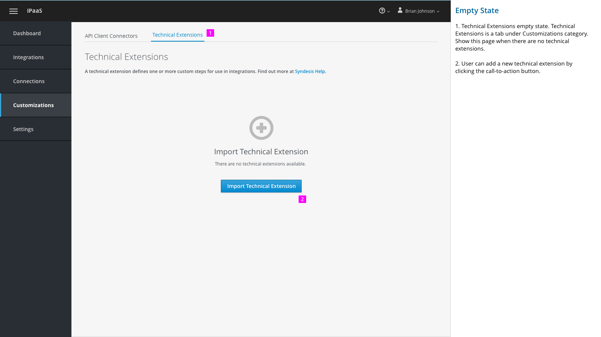
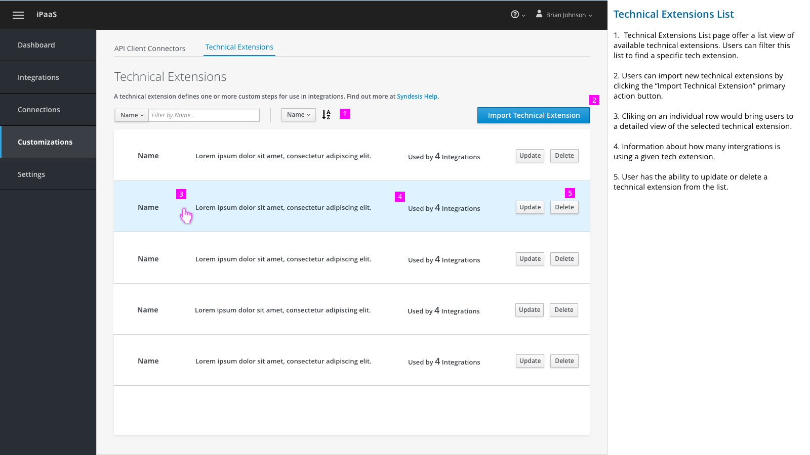
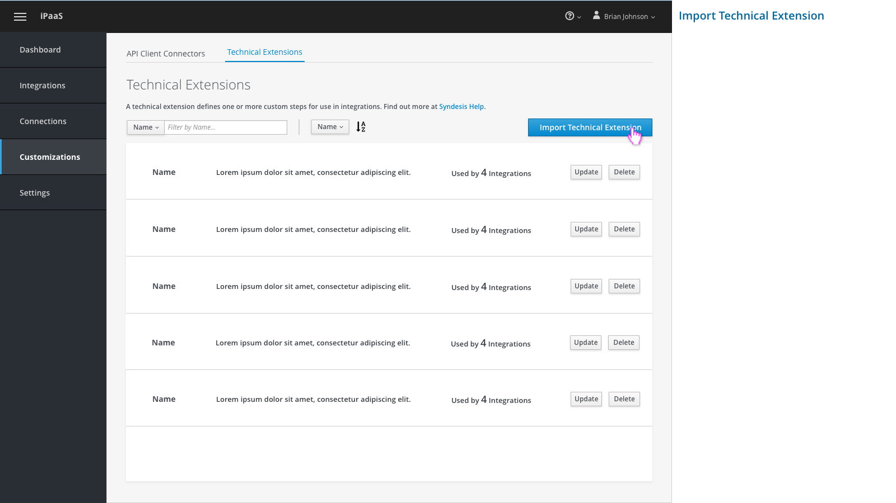
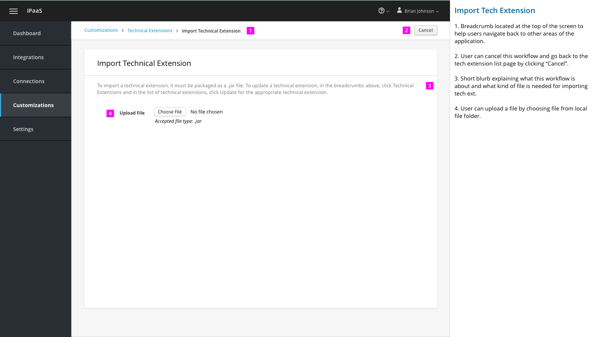
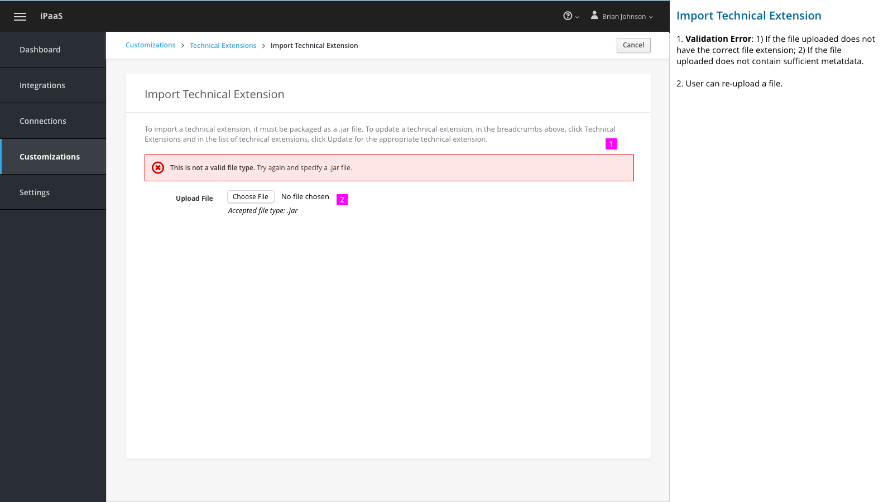
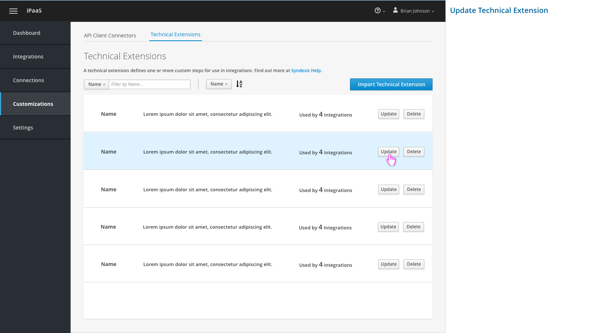
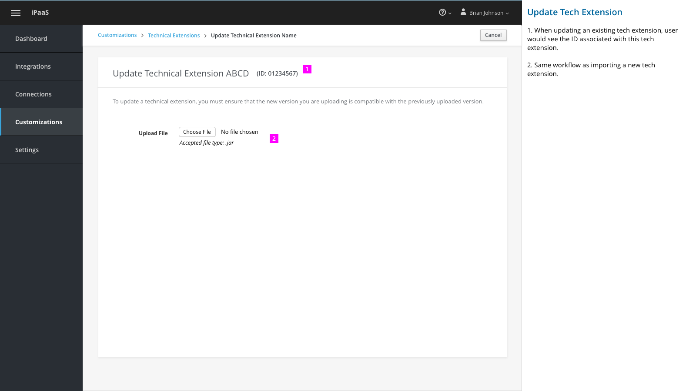
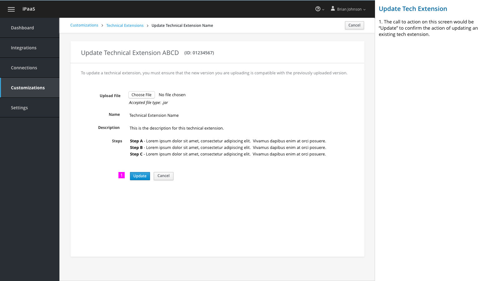
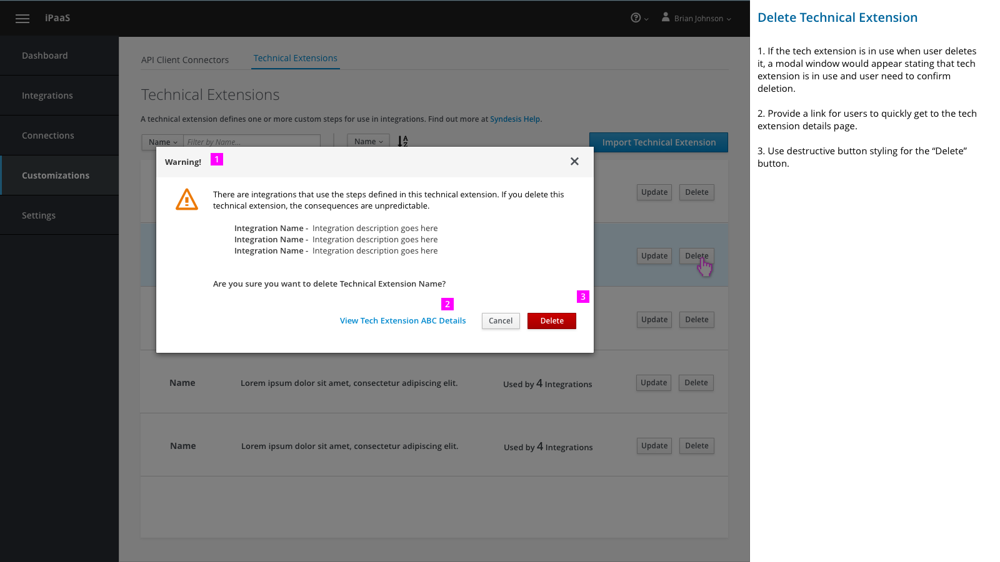
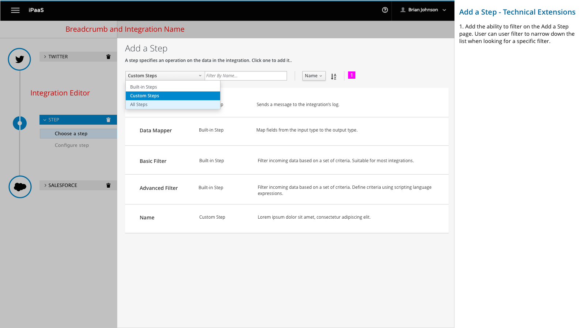

# Technical Extension

This design covers the following workflows:
- Overview (Empty State, List View, and Details View)
- Import new technical extension
- Update an existing technical extension
- Delete a technical extension

## Overview

### Empty State

1. Technical Extensions empty state. Technical Extensions is a tab under Customizations category. Show this page when there are no technical extensions.

2. User can add a new technical extension by clicking the call-to-action button.

### Tech Extension List

1.  Technical Extensions List page offer a list view of available technical extensions. Users can filter this list to find a specific tech extension.

2. Users can import new technical extensions by clicking the “Import Technical Extension” primary action button.  

3. Cliking on an individual row would bring users to a detailed view of the selected technical extension.

4. User has the ability to upldate or delete a technical extension from the list.  

### Tech Extension Details

1.  Users can view details of a technical extension. Tech extension id is included alongside the title of the tech extension.

2. Users can update technical extension by clicking on the Update button.  

3. User can inline edit Name and Description.

## Import New Technical Extension

User select "Import Technical Extension" to start the workflow.

### Choose File

1. Breadcrumb located at the top of the screen to help users navigate back to other areas of the application.

2. User can cancel this workflow and go back to the tech extension list page by clicking “Cancel”.

3. Short blurb explaining what this workflow is about and what kind of file is needed for importing tech ext.

4. User can upload a file by choosing file from local file folder.

### Uploading File

1. Show a spinner when uploading the file.

1. Validation Error: 1) If the file uploaded does not have the correct file extension; 2) If the file uploaded does not contain sufficient metatdata.

2. User can re-upload a file.

### Review Details and Confirm Import

1.  The bottom part of the page would appear if user’s file uploaded successfully. Fields would autopopulate with information extracted from the uploaded file. User would be able to see the tech extension ID.

2. User can edit both Name and Description fields.

3. User can review steps included in the tech extension file.

4. Select “Import” to confim importing the tech extension.  

## Update Existing Technical Extension

Select "Update" to update a specific technical extension.

1. When updating an existing tech extension, user would see the ID associated with this tech extension.

2. Same workflow as importing a new tech extension.

1. The call to action on this screen would be “Update” to confirm the action of updating an existing tech extension.

## Delete a Technical Extension

Select "Delete" to delete a specific technical extension.

1. If the tech extension is in use when user deletes it, a modal window would appear stating that tech extension is in use and user need to confirm deletion.

2. Use destructive button styling for the “Delete” button.

## Technical Extensions in Create Integration - Add a Step

1. Add the ability to filter on the Add a Step page. User can user filter to narrow down the list when looking for a specific filter.

1. When user selects Custom Steps, only custom steps are shown on this page.
