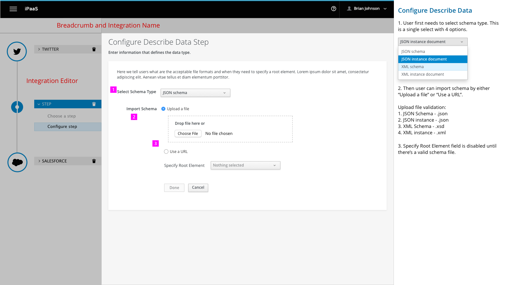
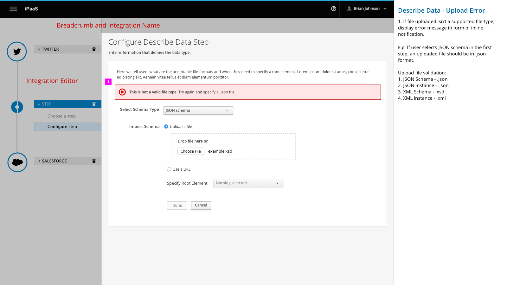

# Describe Data Step

Users can add a "Describe Data" step to an integration flow that declares the current data type.

## Add a Step

1. User selects “Describe Data” as the step to declare data type.

## Configure Describe Data Step

1. User first needs to select schema type. This is a single select with 4 options.
  - JSON schema
  - JSON instance document
  - XML schema
  - XML instance document

2. Then user can import schema by either “Upload a file” or “Use a URL”.

    Upload file validation:
    - JSON Schema - .json
    - JSON instance - .json
    - XML Schema - .xsd
    - XML instance - .xml

3. Specify Root Element field is disabled until there’s a valid schema file.

1. Show a spinner when uploading the file.

2. When a file is in the upload process, the drop file zone and choose file button is disabled.

1. If file uploaded isn’t a supported file type, display error message in form of inline notification.  

  E.g. If user selects JSON schema in the first step, an uploaded file should be in .json format.

  Upload file validation:
    - JSON Schema - .json
    - JSON instance - .json
    - XML Schema - .xsd
    - XML instance - .xml

1. User can also import schema via a valid URL. Provide “http://“ as syntax hint for users. Once users start typing, they can override the syntax hint.

2. Inline action button “Import” placed to the right of the field that it affects.

3. Syntax hint for Use a URL field.

1. If URL isn’t valid or reachable, display error message in form of inline notification. Highlight the form field with a red border and hightlight the syntax hint in red.

1. Specify root element selection would be hidden if user selects instance doc instead of schema in the first dropdown.
